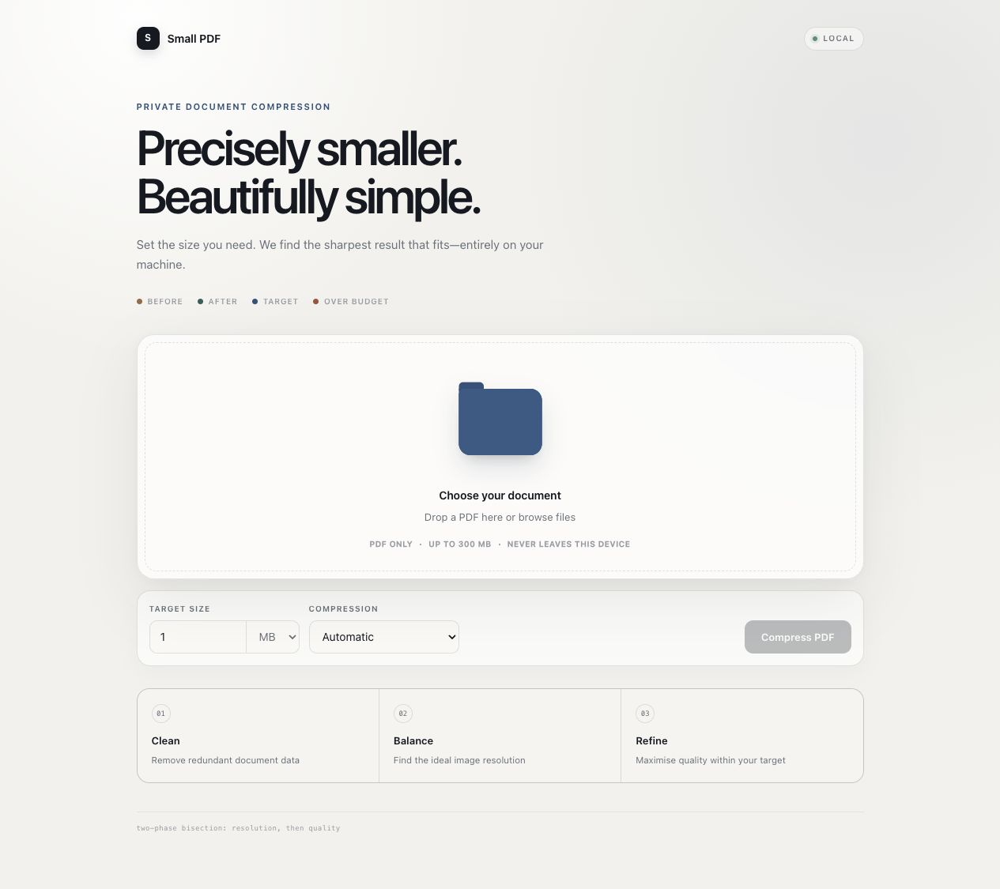
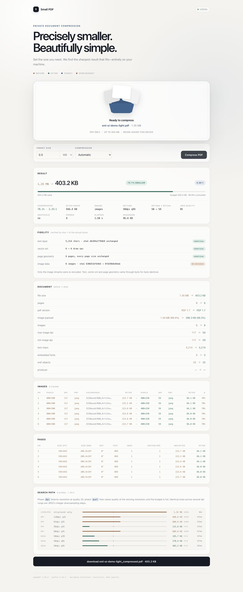

<div align="center">

# Small PDF

**Precisely smaller. Beautifully simple.**

Target-size PDF compression that spends your byte budget instead of wasting it —
with the sharpest image settings that fit and a full structural read-out of every change.

`macOS` · `Windows` · `Linux` · `Private by design` · `No upload required`

</div>



## Why Small PDF

- **Target the size you actually need.** Enter `1 MB`, `900 KB`, or any exact budget.
- **Keep the best quality that fits.** Two-phase bisection searches resolution first, then spends the remaining budget on JPEG quality.
- **See what changed.** The report shows document structure, image payloads, per-page data, fidelity checks, and every compression probe.
- **Keep documents private.** Processing happens locally on your machine; the browser UI never sends a PDF to a third-party service.

## The app

Choose a document, set the target size, and let the automatic engine find the best result.



---

## The problem

Every PDF compressor hands you three buttons: *low*, *recommended*, *extreme*. You need
1 MB. You click *recommended*, get 2.4 MB, click *extreme*, get 340 KB that looks like a
fax. Neither one is 1 MB, and the second threw away two thirds of the quality you were
entitled to.

Target size is the thing you actually care about. It should be the input.

## The insight

A target size is a **budget to spend**, not a ceiling to duck under. So this searches in
two phases:

| Phase | What it does |
|:--|:--|
| `00` lossless | Strip metadata, subset fonts, rebuild the xref table. If that alone meets your target, no pixel is ever touched. |
| `01` resolution | Bisect a DPI ladder at deliberately low probe quality, to find the highest resolution that can possibly fit. |
| `02` quality | Hold that resolution and bisect JPEG quality **upward** until the budget is full. |

Phase `02` is the whole point.

On a 12 MB, 300 dpi scanned document targeting 1 MB:

| Approach | Result | Verdict |
|:--|:--|:--|
| Naive single-pass search | `q30` → 343 KB | Hits the target. Wastes 65% of the budget. |
| **Two-phase bisection** | `q80` → **938 KB** | Same 1 MB limit. Visibly sharper. |

Both "succeed." Only one gives you the file you asked for.

## The part nobody tells you about DPI

Embedded JPEGs can only be downsampled by **integer DCT factors**. A 300 dpi scan can
become 150, 75, or 37 dpi — and nothing in between. Ask for 80 dpi and you silently get
150. Ask for 72 and you get 75.

Most tools accept your number and quietly ignore it. This one shows you: in the search
path, several DPI rungs return byte-identical sizes, then one falls off a cliff. Every
reported DPI is the **effective** value, never the requested one.

```
LOSSLESS  structural only    ████████████████████  2.78 MB  OVER
DPI       110dpi q35         ██████████            1.16 MB  OVER
DPI        65dpi q35         ████                443.8 KB  OVER
DPI        50dpi q35         █                   157.7 KB  FITS
DPI        60dpi q35         ████                443.8 KB  OVER   <- identical to 65dpi
QUAL       50dpi q70         ██                  243.0 KB  FITS
QUAL       50dpi q85         ██                  335.9 KB  FITS
QUAL       50dpi q95         ███                 538.2 KB  OVER
QUAL       50dpi q90         ███                 402.8 KB  OVER
```

## Everything it tells you

| Panel | What's in it |
|:--|:--|
| **result** | before → after, compression percentage and ratio, bytes saved, budget consumed, engine, setting, DPI requested → actual, quality, probe count, elapsed |
| **fidelity** | what survived intact — text layer, vector art, page geometry, image data, metadata — each with a verdict of `identical` / `re-encoded` / `lost` |
| **document** | file size, pages, PDF version, image payload and its share of the file, image count, max/min DPI, text characters, embedded fonts, xref objects, producer — all before → after |
| **images** | every embedded image: pixel dimensions, effective DPI, format, colorspace, stored bytes → after, plus per-image delta |
| **pages** | per page: size in points *and* millimetres, rotation, text characters, image count, vector operations, image bytes before → after |
| **search path** | every probe: phase, DPI/quality, resulting size drawn against the target line, verdict, timing |

Colour is load-bearing: sand is always a *before* value, mint is always *after*, peach
means over budget.

### Lossless claims you can check

"Lossless" is usually a marketing word. Here it is a measurement. Text runs and image
streams are compared by **SHA-1 of their actual bytes**, before and after — an identical
character count would not prove text is unchanged, but an identical digest does.

```
text layer      12,470 chars · sha1 793e3f0f2bcf unchanged        IDENTICAL
vector art      12 -> 12 draw ops                                 IDENTICAL
page geometry   6 pages, every page size unchanged                 IDENTICAL
image data      6 images · sha1 f90884179fee -> 46ce6bf9db12      RE-ENCODED
```

So on a typical document the honest claim is precise: *only the image streams were
re-encoded; text, vector art and page geometry came through byte-for-byte identical.*
When the lossless pass alone meets your target, the image digest matches too and nothing
was re-encoded at all. When the raster engine has to be used, text is reported as `LOST` —
because it is. Anything the tool cannot prove, it does not assert.

## Run it

```bash
git clone https://github.com/PruthvinBatham/sml-pdf.git
cd sml-pdf
pip install pymupdf

python3 run.py     # macOS / Linux   (or ./run.sh)
py run.py          # Windows         (or double-click run.bat)
```

Opens `http://127.0.0.1:8000`. Drop a PDF on the folder, set a target, compress.

Prerequisites are **Python 3.9+ with PyMuPDF** and **Node.js** (used once, to build the
UI). The server is Python standard library — no Flask, no FastAPI, no bundled binaries to
ship per platform.

```bash
python3 run.py --port 9000 --rebuild --no-browser
```

## Command line

```bash
python3 compress_pdf.py report.pdf -t 1MB
python3 compress_pdf.py scan.pdf -t 900kb -o small.pdf --stats
python3 compress_pdf.py scan.pdf -t 1MB --json report.json
python3 compress_pdf.py *.pdf -t 2MB --suffix _web
```

| Flag | Meaning |
|:--|:--|
| `-t, --target` | `1MB`, `900kb`, `1500000` — required |
| `-o, --output` | output path (single input only) |
| `--suffix` | suffix for auto-named output (default `_compressed`) |
| `--mode` | `auto` (default), `images`, `raster` |
| `--stats` | full before/after analysis and search path, as a table |
| `--json FILE` | the entire report, machine-readable |
| `-v, --verbose` | every probe as it runs |

It never overwrites the input. If your target is genuinely unreachable it writes the
smallest achievable file and says so on stderr, rather than pretending it succeeded.

## Two engines

**images** — recompresses only the embedded images. Text and vector art stay vector, so
they render sharp at any zoom and remain selectable and searchable. Tried first, always.

**raster** — flattens each page to a single JPEG. Reaches sizes the image engine cannot,
but **loses selectable text**. Used automatically only if `images` cannot reach your
target, and the UI tells you when that happens.

## Design notes

The browser POSTs the PDF as the raw request body rather than a multipart form, so there
is no form parsing server-side — which also sidesteps `cgi`, removed in Python 3.13. The
response is the JSON report; compressed bytes are held under an id (last 8 results,
30-minute TTL) and fetched separately so the download gets a real filename.

PyMuPDF does all the PDF work. That single dependency is deliberate: it is why the same
code runs on macOS, Windows and Linux without shipping a different binary toolchain for
each one.

| Path | What it is |
|:--|:--|
| `compress_pdf.py` | the compressor — CLI, `compress()` API, and `analyze()` |
| `server.py` | stdlib HTTP server; `POST /api/compress`, `GET /api/result/<id>` |
| `run.py` | cross-platform launcher (build if stale, then serve) |
| `run.sh` / `run.bat` | thin wrappers around `run.py` |
| `web/` | Vite + React UI |

### Working on the UI

```bash
python3 server.py          # terminal 1
npm --prefix web run dev   # terminal 2 -> http://127.0.0.1:5173, proxies /api
```

## Credits

Folder component from [ReactBits](https://reactbits.dev), extended with optional
`open`/`onOpenChange` props so the page can open it on drag-over.

Prior art worth reading: [MinimalPDF Compress](https://github.com/deminimis/minimalpdfcompress)
for its mode structure and granular image pipeline, and
[quantpdf-cli](https://github.com/paradoxie/quantpdf-cli) for target-size CLI ergonomics
and JSON output. Both orchestrate external binaries (Ghostscript, cpdf, pikepdf, Poppler);
this stays on PyMuPDF alone to keep one dependency and three platforms.

## License

MIT
